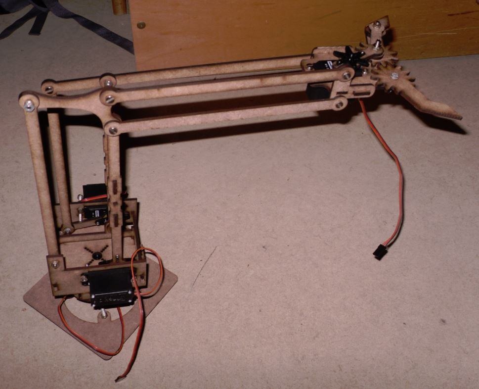

meArm
-----

A robot arm. This is a adaptation of the [original meArm](http://store.hackaday.com/products/mearm-pocket-sized-robot-arm).

It was adapted to make use of

- 4mm M 4 screws as found in the [Stabilbaukasten Construction kit](http://stabilbaukasten.de)
- [Modelcraft RS-2 Servo](http://www.servodatabase.com/servo/modelcraft/rs-2) which is bigger than the original.

